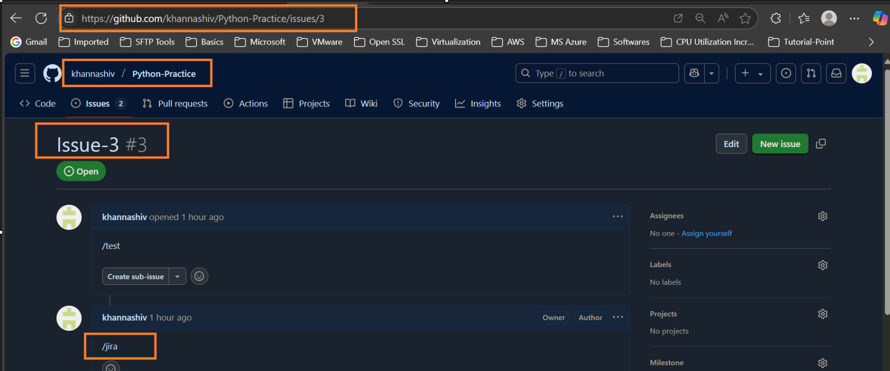
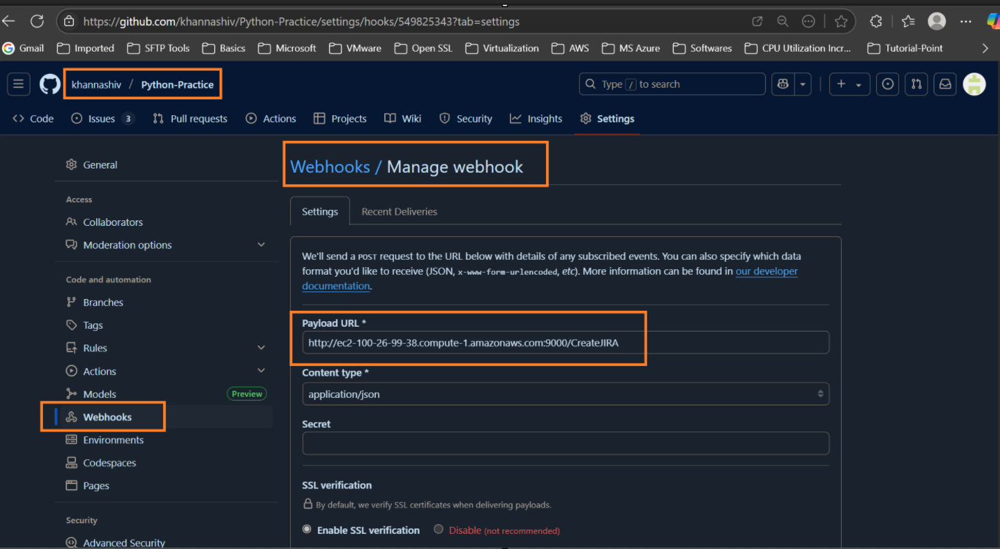
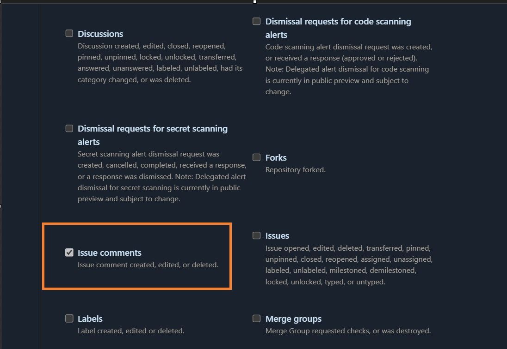
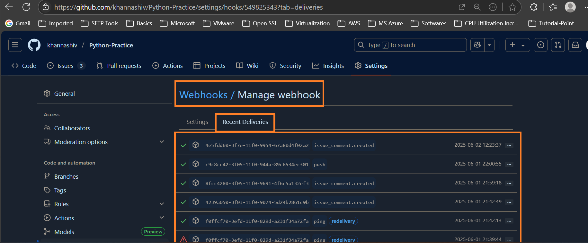
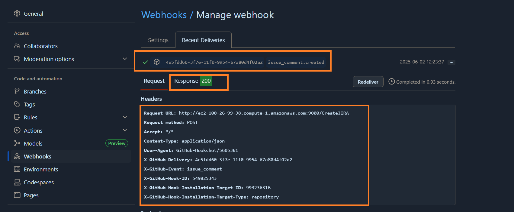
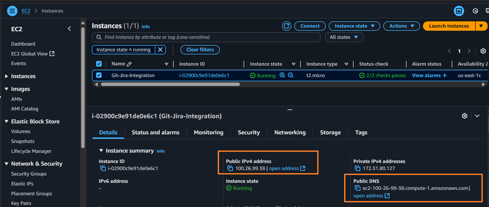
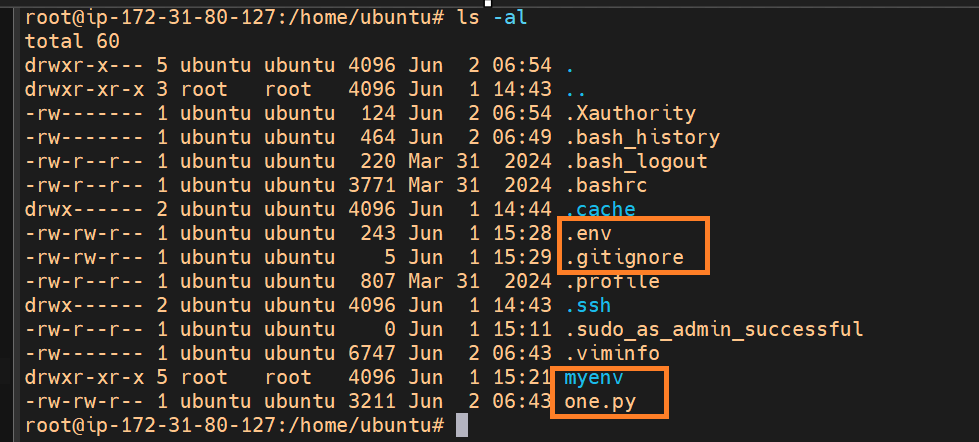
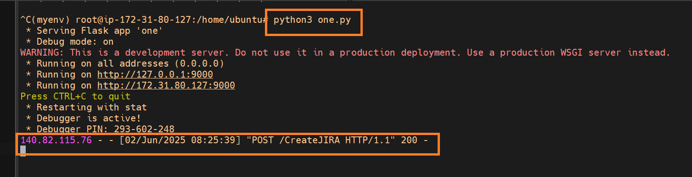
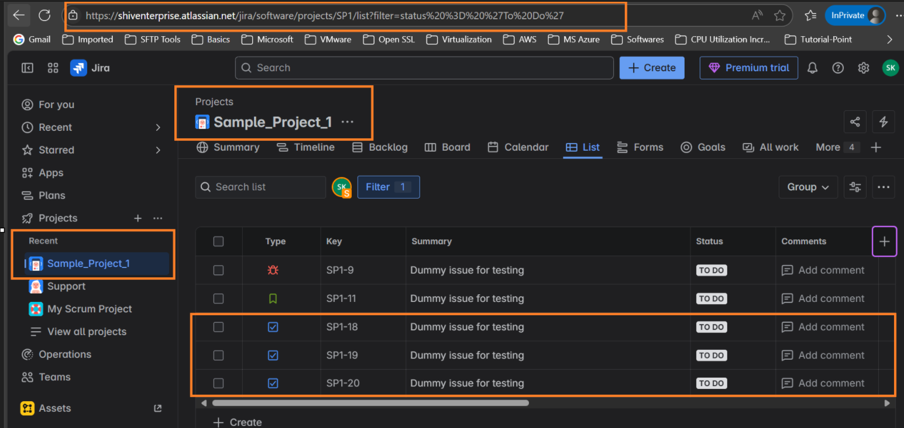

## Automating Git Jira Integration.

- Here we are automating git integration with jira such that whenever someone type "/jira" under issues section of github ( and select particular issue from there ) as part of comment under specific repository it should create a Jira ticket of type "task" under the particular project that resides under Jira dashboard.

- `Flow` : Github ( via webhook where webhook typs is : "Issue comments") send information in the json to EC2 server in the form of post request/method  --- > EC2 ( Hosting my python flask application will make an api call of type post again. ) --- > Jira  (Which will further create an issue of type task)

- We have created virtual environment on EC2 ubuntu OS since there were issues in installaing flask framework.
    - `python3 -m venv myenv`
        - Purpose: Creates a virtual environment named myenv.
        - Explanation: A virtual environment is an isolated Python environment that allows you to install packages without affecting the system-wide Python installation. It's useful for managing dependencies for individual projects.
    - `source myenv/bin/activate`
        - Purpose: Activates the virtual environment.
        - Explanation: Once activated, your shell session uses the Python and pip from the virtual environment rather than the global ones. This ensures you're working in the isolated environment created in step 1.
    - `pip install flask`
        - Purpose: Installs the Flask web framework inside the virtual environment.
        - Explanation: Flask is a lightweight Python web framework. This command makes Flask available for use in this project.
    - `python3 <one.py or your name of your python script>`
        - Purpose: Runs a Python script named one.py.
        - Explanation: The script likely contains code that uses Flask (e.g., starts a web server). Since we're in the virtual environment where Flask is installed, the script can run successfully.
    - Summary of above commands.
            - Set up a clean Python environment.
            - Activate it.
            - Install Flask (a web framework).
            - Run a Python script that likely starts a Flask-based web application.
            - NOTE : To deactivate virtual environment use command i.e. `deactivate`  # Deactivates it

- **Outcomes of the Project**

- 
- 
- 
- 
- 
- 
- 
- 
- 
