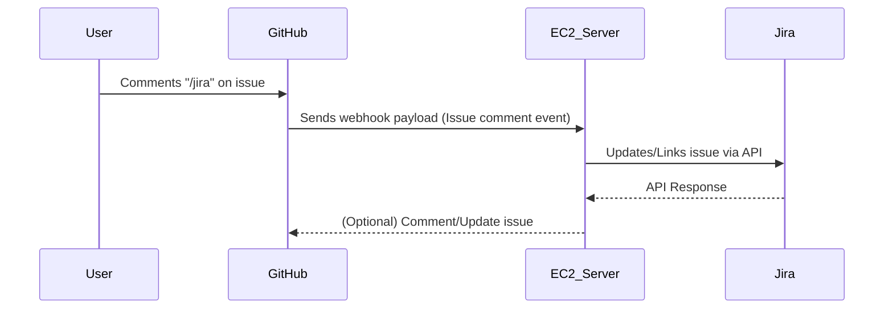
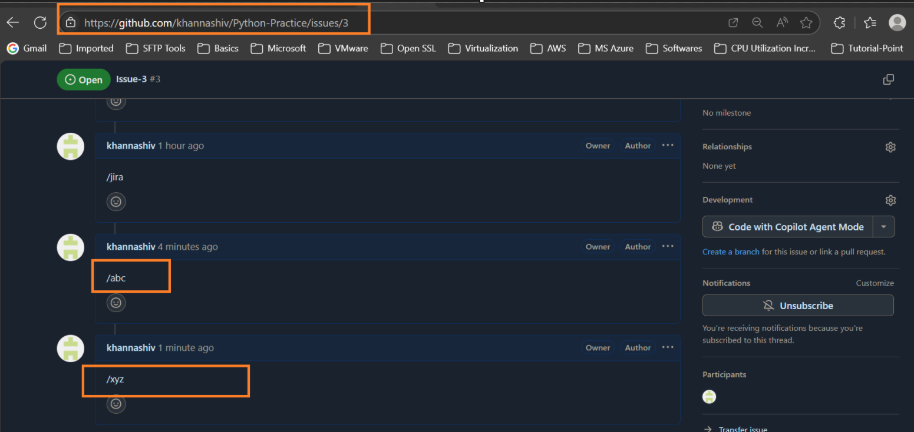
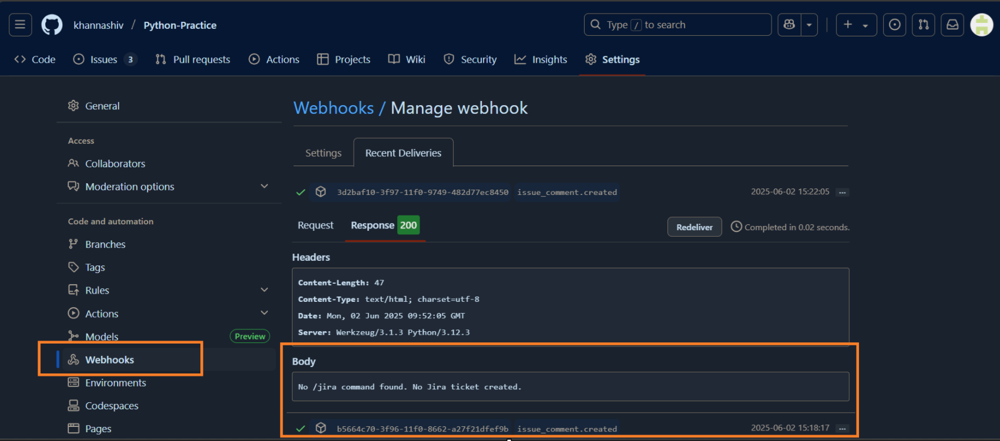
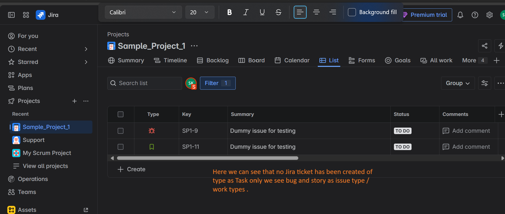

# Project-3: Automating GitHub–Jira Integration

This project automates the integration between GitHub and Jira. Whenever a user comments `/jira` under a GitHub issue and selects a particular Jira issue, the integration triggers actions that connect GitHub issue activity to Jira seamlessly.

---

## 🛠️ Project Overview

- **Purpose:**  
  Automate the process of linking GitHub issues with Jira tickets using a webhook and a Python Flask server.

- **How it Works:**  
  1. A user comments `/jira` on a GitHub issue and selects a Jira issue.
  2. GitHub sends a webhook payload (type: "Issue comments") to an EC2 server.
  3. The EC2 server, running a Flask application, processes the payload and interacts with Jira as required.

---

## 📋 Prerequisites

- **AWS EC2 instance** (Ubuntu recommended)
- **Python 3.x** installed
- **GitHub repository** with webhook configured (event: "Issue comments")
- **Jira account** with API access
- **Jira API credentials** (for authentication)
- **Flask** (Python web framework)

---

## 🚀 Setup & Usage Instructions

### 1. Clone the Repository

```bash
git clone https://github.com/khannashiv/Python-Practice.git
cd Python-Practice/Project-3
```

### 2. Create & Activate a Virtual Environment

```bash
python3 -m venv myenv         # Create a virtual environment named 'myenv'
source myenv/bin/activate     # Activate the virtual environment
```

### 3. Install Dependencies

```bash
pip install flask
# Add any other requirements here, e.g.:
# pip install requests python-dotenv
```

### 4. Configure Environment Variables

Create a `.env` file (if needed) to store sensitive data such as Jira API credentials.

### 5. Run the Flask Application

```bash
python3 <your_flask_script.py>
# Example:
# python3 one.py
```

### 6. Webhook Setup

- In your GitHub repository, add a webhook with:
  - **Payload URL:** The public URL of your EC2 server (ensure ports are open and server is accessible)
  - **Content Type:** `application/json`
  - **Event:** `Issue comments`

---

## 🔄 Integration Flow



---

## 📷 Outcomes & Screenshots

Below are example screenshots showing the integration in action:

- 
- 
- 
- 
- 
- 
- 
- 
- 
- 
- 
- 

---

## 📝 Notes

- To deactivate the virtual environment:
  ```bash
  deactivate
  ```
- Ensure your EC2 instance allows inbound traffic on the port used by Flask (default: 5000, whereas in our case app is running on 9000).
- For production, consider using a production-ready server (e.g., Gunicorn) and HTTPS.

---

## 📚 References

- [Flask Documentation](https://flask.palletsprojects.com/)
- [GitHub Webhooks](https://docs.github.com/en/webhooks)
- [Jira REST API Documentation](https://developer.atlassian.com/cloud/jira/platform/rest/v3/)
- [Understanding the Difference Between `get_json()` and `request.json` in Flask](https://medium.com/@obotnt/understanding-the-difference-between-get-json-and-request-json-in-flask-d612d1fbc895)


<!-- 

Q : What is request.get_json()?
Sol : 
- When the client sends the POST request with the JSON data, the Flask application receives the request in the request object.
- The request.get_json() method is called to parse the JSON data from the request body.
- Flask automatically converts the JSON string into a Python dictionary so that you can work with it easily.
- We can now access the data like any other dictionary in Python (using data['key']).
- Flask returns a JSON response to the client confirming the task that needs to be performed.

>> In Flask, the request object represents the incoming HTTP request made by a client (like a browser or a tool like Postman or cURL). When we send data in a POST request, especially JSON data, it’s included in the request body.

>> request.get_json() is a method in Flask used to extract JSON data sent in the request body. When a client sends data as JSON, this method will parse the JSON and convert it into a Python dictionary so that your Python code can work with it.

 -->